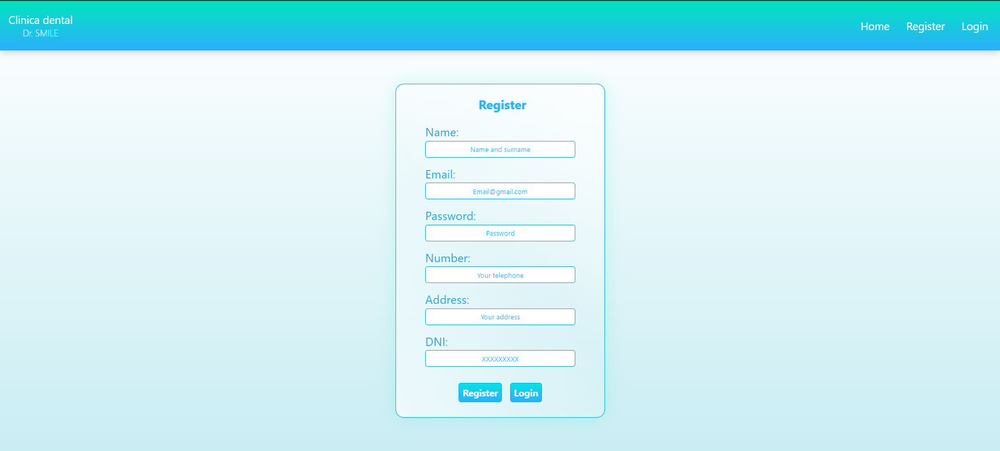
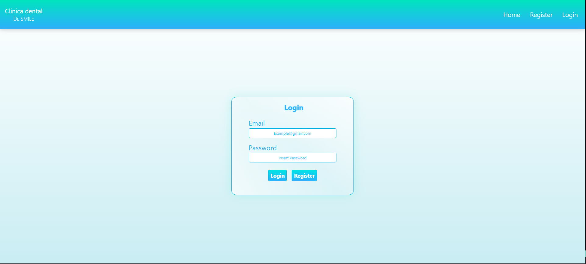
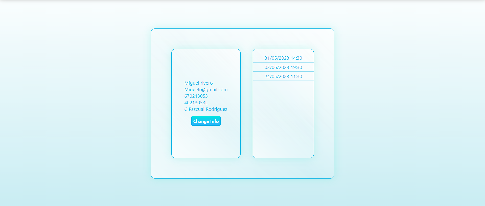
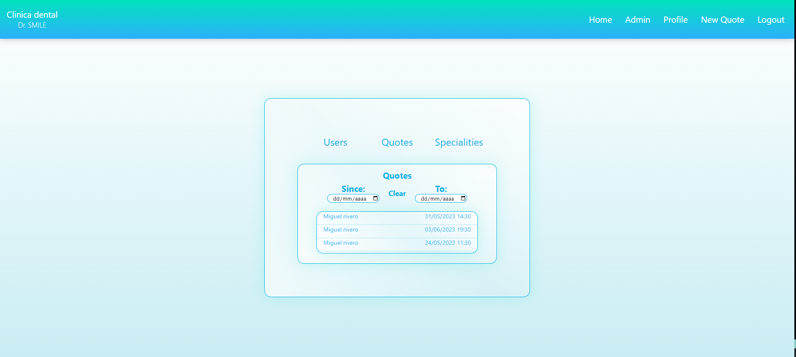
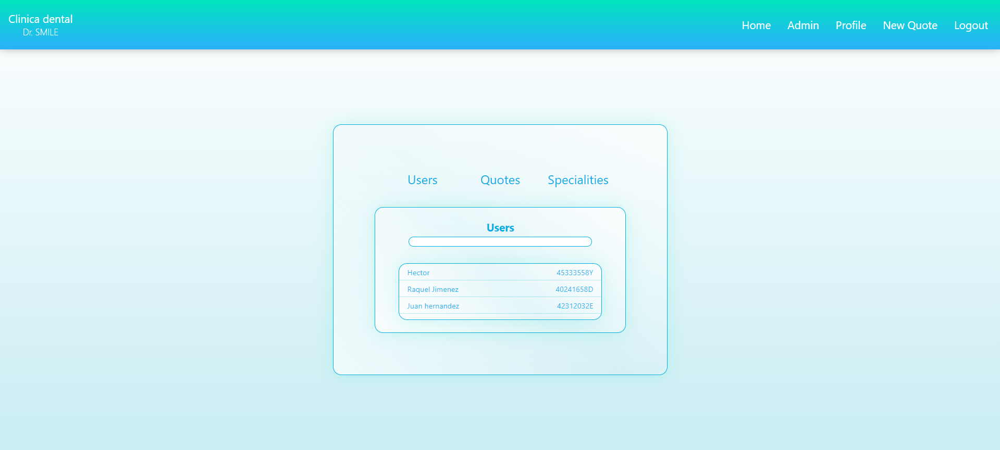

# DENTAL CLINIC #

**Author:** Héctor Ginory

**Tecnologies:** ReactJS, HTML, CSS3, JavaScript - ES6, Git

<a href="">Click here to see the site</a>

## CHALLENGE ##
The chanllenge was to connect create a Frontend to our previous proyect, the backend of a dental clinic.
 
<a href="https://github.com/HectorGinory/Backend_ClinicaDental">Click here to see the repository</a>
 
 
Taking into account the requirements, we can advise on the views
necessary for the proper functioning of the application.

- User Registration.

- User login.

- User profile.
- View of appointments that I have as a client (only my own).

- View of all existing appointments (as a admin).
- Appointment search / creation / modification panel.

- View of all users registered on the platform (such as
administrator).

